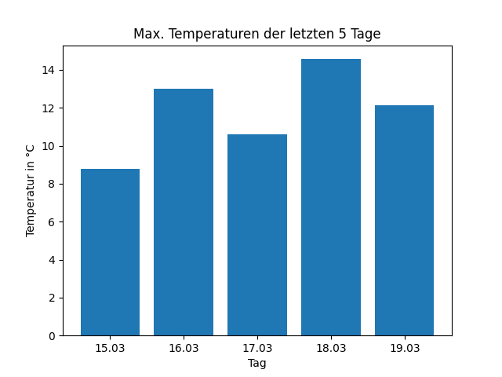

# weather-history

Simple Python Script which shows the weather history for the last 5 days at a specified region. Made for the sake of gaining experience with API stuff, datetime/time module and matplotlib.

To use it, put your API-Key instead of the 'xxx'. You can get one for free on the openweathermap website.

